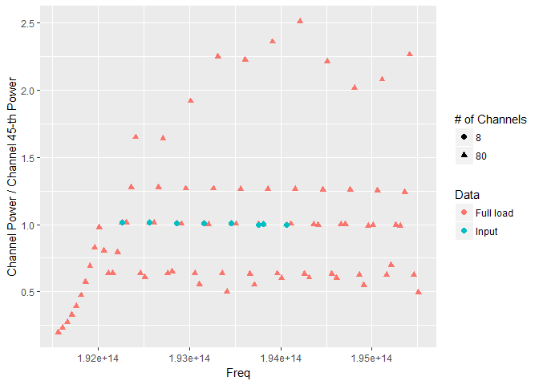

# Predictive Wavelength Switching Project
Zahra Bakhtiari, Sergey Samsonau  
October, 2016  


Loading libraries


```r
library(stringr); library(dplyr); library(readxl); library(ggplot2)
```

# The Goal

Predict the value of the gain at other channels by having few input channels. This code provides the best wavelength choices for several-add events with pre-existing channels supplied in Input file

## Script Parameters

Following parameter defines the number of newly added wavelengths


```r
num_add_wl <- 3
```

Next parameter defines the gap for divergence of power between ripples, the ideal value is 0.


```r
m_pre = 0.08 # margin for pre_ext
m_new = m_pre # margin for new
```


## Data Preparation

### Location, names, structure of the files with data

There are two files specified:

* file with fully loaded bands
* Input file with initial numbe of bands loaded 


```r
# Give the values
# * directory with data
data_dir_path <- "./data/"
# * name of the file with fully loaded bands
FLB_filename <- "Fully Loaded Band.xlsx"
# * name of the file with Input
Input_filename <- "Input.xlsx"
# * names of coloumns in files
col_names <- c("Freq", "wl", "PowerIn", "PowerOut", "Gain")
```

### Reading data


```r
if(exists("tb_Total")) rm(tb_Total)
# read fully loaded bands file
tb_FLB <- read_excel(str_c(data_dir_path, FLB_filename), skip = 1)
names(tb_FLB) <- col_names

if(exists("tb_Input")) rm(tb_Input)
# read input file
tb_Input <- read_excel(str_c(data_dir_path, Input_filename), skip = 1)
names(tb_Input) <- col_names
```

How many distinct frequencies in the loaded data


```r
# full load bands
num_FLB <- length(unique(tb_FLB$Freq))
num_FLB
```

```
## [1] 80
```

```r
# input bands
num_Input <- length(unique(tb_Input$Freq))
num_Input
```

```
## [1] 8
```

### create IDs for frequencies


```r
freq_map <- select(tb_FLB, Freq) %>%
  arrange(Freq) %>%
  mutate(freq_text_id = str_c("g_", str_pad(1:num_FLB, 2, pad = "0")),
         freq_num_id = str_pad(1:num_FLB, 2, pad = "0")) # as.numeric

# checking
freq_map
```

```
## # A tibble: 80 × 3
##          Freq freq_text_id freq_num_id
##         <dbl>        <chr>       <chr>
## 1  1.9156e+14         g_01          01
## 2  1.9161e+14         g_02          02
## 3  1.9166e+14         g_03          03
## 4  1.9171e+14         g_04          04
## 5  1.9176e+14         g_05          05
## 6  1.9181e+14         g_06          06
## 7  1.9186e+14         g_07          07
## 8  1.9191e+14         g_08          08
## 9  1.9196e+14         g_09          09
## 10 1.9201e+14         g_10          10
## # ... with 70 more rows
```

Add frequency IDs to corresponding places. Also add column containing data type.


```r
tb_FLB <- tb_FLB %>%
  full_join(freq_map) %>%
  mutate(data_type = "Full load") %>%
  arrange(freq_num_id)

tb_FLB
```

```
## # A tibble: 80 × 8
##          Freq           wl PowerIn  PowerOut       Gain freq_text_id
##         <dbl>        <dbl>   <dbl>     <dbl>      <dbl>        <chr>
## 1  1.9156e+14 1.565006e-06     -30 -37.09882 -7.0988169         g_01
## 2  1.9161e+14 1.564597e-06     -30 -36.38302 -6.3830241         g_02
## 3  1.9166e+14 1.564189e-06     -30 -35.66880 -5.6687978         g_03
## 4  1.9171e+14 1.563781e-06     -30 -34.91138 -4.9113783         g_04
## 5  1.9176e+14 1.563373e-06     -30 -34.11669 -4.1166938         g_05
## 6  1.9181e+14 1.562966e-06     -30 -33.31893 -3.3189328         g_06
## 7  1.9186e+14 1.562558e-06     -30 -32.48775 -2.4877500         g_07
## 8  1.9191e+14 1.562151e-06     -30 -31.65658 -1.6565762         g_08
## 9  1.9196e+14 1.561744e-06     -30 -30.89328 -0.8932813         g_09
## 10 1.9201e+14 1.561338e-06     -30 -30.17117 -0.1711703         g_10
## # ... with 70 more rows, and 2 more variables: freq_num_id <chr>,
## #   data_type <chr>
```

```r
tb_Input <- tb_Input %>%
  full_join(freq_map) %>%
  mutate(data_type = "Input") %>%
  arrange(freq_num_id)
  
tb_Input
```

```
## # A tibble: 80 × 8
##          Freq    wl PowerIn PowerOut  Gain freq_text_id freq_num_id
##         <dbl> <dbl>   <dbl>    <dbl> <dbl>        <chr>       <chr>
## 1  1.9156e+14    NA      NA       NA    NA         g_01          01
## 2  1.9161e+14    NA      NA       NA    NA         g_02          02
## 3  1.9166e+14    NA      NA       NA    NA         g_03          03
## 4  1.9171e+14    NA      NA       NA    NA         g_04          04
## 5  1.9176e+14    NA      NA       NA    NA         g_05          05
## 6  1.9181e+14    NA      NA       NA    NA         g_06          06
## 7  1.9186e+14    NA      NA       NA    NA         g_07          07
## 8  1.9191e+14    NA      NA       NA    NA         g_08          08
## 9  1.9196e+14    NA      NA       NA    NA         g_09          09
## 10 1.9201e+14    NA      NA       NA    NA         g_10          10
## # ... with 70 more rows, and 1 more variables: data_type <chr>
```

```r
tb_Input %>% filter(! is.na(wl))
```

```
## # A tibble: 8 × 8
##         Freq           wl PowerIn  PowerOut       Gain freq_text_id
##        <dbl>        <dbl>   <dbl>     <dbl>      <dbl>        <chr>
## 1 1.9226e+14 1.559307e-06     -23 -23.12735 -0.1273539         g_15
## 2 1.9256e+14 1.556878e-06     -23 -23.13440 -0.1343965         g_21
## 3 1.9286e+14 1.554456e-06     -23 -23.13968 -0.1396847         g_27
## 4 1.9316e+14 1.552042e-06     -23 -23.15394 -0.1539382         g_33
## 5 1.9346e+14 1.549635e-06     -23 -23.16283 -0.1628293         g_39
## 6 1.9376e+14 1.547236e-06     -23 -23.19146 -0.1914555         g_45
## 7 1.9381e+14 1.546837e-06     -23 -23.17558 -0.1755805         g_46
## 8 1.9406e+14 1.544844e-06     -23 -23.19853 -0.1985303         g_51
## # ... with 2 more variables: freq_num_id <chr>, data_type <chr>
```

### Calculation of ratios


```r
# FLB
for (id in tb_FLB$freq_text_id) {
  root_gain <- filter(tb_FLB, freq_text_id == id) %>%
    select(Gain) %>% unlist()
  tb_FLB[, str_c(id, "_over")] <-
    (10 ^ (tb_FLB$Gain / 10)) / (10 ^ (root_gain / 10))
}

# Input
for (id in tb_Input$freq_text_id) {
  root_gain <- filter(tb_Input, freq_text_id == id) %>%
    select(Gain) %>% unlist()
  tb_Input[, str_c(id, "_over")] <-
    (10 ^ (tb_Input$Gain / 10)) / (10 ^ (root_gain / 10))
}
```

Combine both data sets in one tibble


```r
tb_Total <- rbind(tb_FLB, tb_Input)
tb_Total <- tb_Total[, sort(names(tb_Total))]

tb_Total
```

```
## # A tibble: 160 × 88
##    data_type       Freq freq_num_id freq_text_id g_01_over g_02_over
##        <chr>      <dbl>       <chr>        <chr>     <dbl>     <dbl>
## 1  Full load 1.9156e+14          01         g_01  1.000000 0.8480486
## 2  Full load 1.9161e+14          02         g_02  1.179178 1.0000000
## 3  Full load 1.9166e+14          03         g_03  1.389959 1.1787525
## 4  Full load 1.9171e+14          04         g_04  1.654794 1.4033454
## 5  Full load 1.9176e+14          05         g_05  1.987066 1.6851285
## 6  Full load 1.9181e+14          06         g_06  2.387748 2.0249259
## 7  Full load 1.9186e+14          07         g_07  2.891390 2.4520392
## 8  Full load 1.9191e+14          08         g_08  3.501258 2.9692365
## 9  Full load 1.9196e+14          09         g_09  4.174011 3.5397638
## 10 Full load 1.9201e+14          10         g_10  4.929066 4.1800875
## # ... with 150 more rows, and 82 more variables: g_03_over <dbl>,
## #   g_04_over <dbl>, g_05_over <dbl>, g_06_over <dbl>, g_07_over <dbl>,
## #   g_08_over <dbl>, g_09_over <dbl>, g_10_over <dbl>, g_11_over <dbl>,
## #   g_12_over <dbl>, g_13_over <dbl>, g_14_over <dbl>, g_15_over <dbl>,
## #   g_16_over <dbl>, g_17_over <dbl>, g_18_over <dbl>, g_19_over <dbl>,
## #   g_20_over <dbl>, g_21_over <dbl>, g_22_over <dbl>, g_23_over <dbl>,
## #   g_24_over <dbl>, g_25_over <dbl>, g_26_over <dbl>, g_27_over <dbl>,
## #   g_28_over <dbl>, g_29_over <dbl>, g_30_over <dbl>, g_31_over <dbl>,
## #   g_32_over <dbl>, g_33_over <dbl>, g_34_over <dbl>, g_35_over <dbl>,
## #   g_36_over <dbl>, g_37_over <dbl>, g_38_over <dbl>, g_39_over <dbl>,
## #   g_40_over <dbl>, g_41_over <dbl>, g_42_over <dbl>, g_43_over <dbl>,
## #   g_44_over <dbl>, g_45_over <dbl>, g_46_over <dbl>, g_47_over <dbl>,
## #   g_48_over <dbl>, g_49_over <dbl>, g_50_over <dbl>, g_51_over <dbl>,
## #   g_52_over <dbl>, g_53_over <dbl>, g_54_over <dbl>, g_55_over <dbl>,
## #   g_56_over <dbl>, g_57_over <dbl>, g_58_over <dbl>, g_59_over <dbl>,
## #   g_60_over <dbl>, g_61_over <dbl>, g_62_over <dbl>, g_63_over <dbl>,
## #   g_64_over <dbl>, g_65_over <dbl>, g_66_over <dbl>, g_67_over <dbl>,
## #   g_68_over <dbl>, g_69_over <dbl>, g_70_over <dbl>, g_71_over <dbl>,
## #   g_72_over <dbl>, g_73_over <dbl>, g_74_over <dbl>, g_75_over <dbl>,
## #   g_76_over <dbl>, g_77_over <dbl>, g_78_over <dbl>, g_79_over <dbl>,
## #   g_80_over <dbl>, Gain <dbl>, PowerIn <dbl>, PowerOut <dbl>, wl <dbl>
```

Create number of channels column.


```r
tb_Total <- tb_Total %>% 
  group_by(data_type) %>% 
  mutate(num_of_channels = sum(! is.na(Gain))) %>%
  ungroup()

# cheking
tb_Total %>% group_by(data_type) %>% summarise(unique(num_of_channels))
```

```
## # A tibble: 2 × 2
##   data_type `unique(num_of_channels)`
##       <chr>                     <int>
## 1 Full load                        80
## 2     Input                         8
```

### Determine Pre-existing channels in Input


```r
pre_exsit_channels <- tb_Total %>%
  filter(data_type == "Input") %>%
  select(Gain, freq_num_id) %>%
  filter(!is.na(Gain)) %>%
  select(freq_num_id) %>%
  unlist() 

pre_exsit_channels
```

```
## freq_num_id1 freq_num_id2 freq_num_id3 freq_num_id4 freq_num_id5 
##         "15"         "21"         "27"         "33"         "39" 
## freq_num_id6 freq_num_id7 freq_num_id8 
##         "45"         "46"         "51"
```

```r
pr_exsit_ch_names <- str_c("g_", pre_exsit_channels, "_over")

pr_exsit_ch_names
```

```
## [1] "g_15_over" "g_21_over" "g_27_over" "g_33_over" "g_39_over" "g_45_over"
## [7] "g_46_over" "g_51_over"
```


# Plots


```r
# Plot Output power spectrum over channel n-th power with a small power gap between fully loaded band and input channel loading

which_to_plot <- 6
if(which_to_plot > length(pr_exsit_ch_names)) which_to_plot <- 1

ggplot(tb_Total, aes_string(y= pr_exsit_ch_names[which_to_plot], x = "Freq")) +
   geom_point(aes(color = data_type, shape = factor(num_of_channels)), size = 2) +
   labs(shape ='# of Channels') +
   labs(color ='Data') +
   ylab(str_c("Channel Power / Channel ", pre_exsit_channels[which_to_plot],"-th Power"))
```

<!-- -->

If you work in Rstudio, you can use the code bellow to explore all input channels interactively (use settings sign in left top corner of figure). 


```r
library(manipulate)
manipulate({
  ggplot(tb_Total, aes_string(y= pr_exsit_ch_names[which_to_plot], x = "Freq")) +
    geom_point(aes(color = data_type, shape = factor(num_of_channels)), size = 2) +
    labs(shape ='# of Channels') +
    labs(color ='Data') +
    ylab(str_c("Channel Power / Channel ", pre_exsit_channels[which_to_plot],"-th Power"))
}
  , which_to_plot = slider(1, length(pr_exsit_ch_names)))
```

# Calculate recomended frequencies

### Avoiding repetitives

By stacking all pre-existing channel in "avoid_repetitives" tibble, we make sure the newly proposed channels are not repetitive.


```r
# define function helping to do this
compare_test <- function(tb_Total, load_data = "Full load", margin, v = 1) {
  myf = function(x){abs(x - v) < margin} # function to apply to filtering condition
  df_temp <- filter(tb_Total, data_type == load_data) %>%
    select(Freq, freq_num_id, freq_text_id,
           match(pr_exsit_ch_names, names(.))) %>% # selecting col with pre_exist_ch.
    mutate_each(funs(TF = myf),                    # applying margin condition
                -Freq, -freq_num_id, -freq_text_id) %>%
    # take only those rows, where all conditions are TRUE:
    filter(rowSums(.[, str_detect(names(.), "TF")]) == 
             sum(str_detect(names(.), "TF"))) %>% 
    select(-ends_with("TF"))
  
  df_temp
}
 
avoid_repetitives <- compare_test(tb_Total, load_data = "Full load", margin = 1, v = 1) %>%
  filter(! freq_text_id %in% str_c("g_", pre_exsit_channels) ) 
```

### Calculate zzz-s


```r
# num_wl_after_add parameter defines the number of wavelengths after add events
num_wl_after_add <- num_add_wl + length(pre_exsit_channels)

## zz1 defines the total number of possible combination to pick num_add_wl wavelenths out of 80 (excluing pre-existing wavelengths)
zz1 <- combn(avoid_repetitives[, pr_exsit_ch_names[1]] %>% unlist, 
            num_add_wl, simplify=F)

# zzz2 parameter gives the freq_text_id of the num_add_wl newly proposed channels. Type: zzz2[( k parameter value)]
zzz2 <- combn(avoid_repetitives$freq_text_id, num_add_wl, simplify=F)

###########Algorithm OUTCOMEs
# zzz4 parameter gives the num-id of the num_add_wl newly proposed channels. Type: zzz4[( k parameter value)]
zzz4 <- combn(avoid_repetitives$freq_num_id, num_add_wl, simplify=F)

# zzz3 parameter gives the frequencies of the num_add_wl newly proposed channels. This paprameter is the main OUTCOME of this algorithm. Type: zzz3[( k parameter value)]
zzz3 <- combn(avoid_repetitives$Freq, num_add_wl, simplify=F)
####################################################
```

### Go over all cases to calculate c and k


```r
############## Algorithm Core 
c <- 1
k <- 1

while(c <= length(zz1)){
  dff3 <- tb_Total %>%
    filter(
      data_type == "Full load",
      freq_num_id %in% as.numeric( c(pre_exsit_channels, zzz4[[k]] ) )) 
  
  condition_check_1 <- dff3 %>%
    select(match( pr_exsit_ch_names, names(.))) %>%
    summarize_each(funs( abs( sum(., na.rm = T)-num_wl_after_add) > m_new ) ) %>%
    unlist() %>%
    sum()

  condition_check_2 <- dff3 %>%
    select(match( str_c(zzz2[[k]], "_over"), names(.))) %>%
    filter(row_number() <= num_wl_after_add) %>%
    summarize_each(funs( abs( sum(., na.rm = T)-num_wl_after_add) > m_pre ) ) %>%
    unlist() %>%
    sum()
  
  # "OR" condition - at least 1 is True
  if (condition_check_1 + condition_check_2 >= 1){k <- k + 1}
  
  c <- c + 1
}

print(c)
```

```
## [1] 41665
```

```r
print(k)
```

```
## [1] 31945
```

### The proposed frequencies

Based on calculations proposed frequencies are


```r
zzz3[k]
```

```
## [[1]]
## [1] 1.9291e+14 1.9321e+14 1.9436e+14
```

